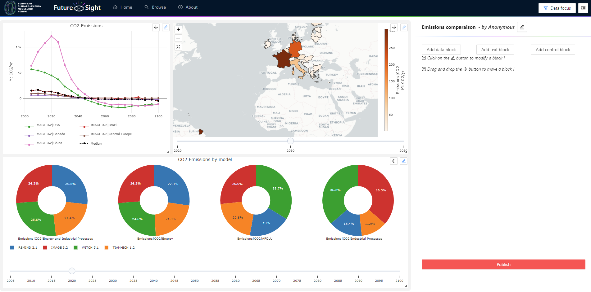
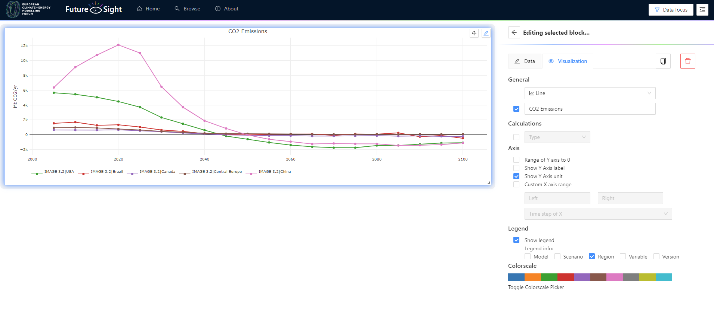

<!-- vscode-markdown-toc-config
	numbering=true
	autoSave=true
	/vscode-markdown-toc-config -->
<!-- /vscode-markdown-toc -->

## 1. <a name='FutureSight'></a>FutureSight

[](https://opensource.org/licenses/MIT)

<!-- vscode-markdown-toc -->

- 2. [Installation](#Installation)
- 3. [About FutureSight](#AboutFutureSight)
- 4. [Team](#Team)
- 5. [Documentation](#Documentation)
  - 5.1. [Directory Structure](#DirectoryStructure)
  - 5.2. [Developpement stack tools](#Developpementstacktools)
    - 5.2.1. [Typescript](#Typescript)
    - 5.2.2. [Node js](#Nodejs)
    - 5.2.3. [Express](#Express)
    - 5.2.4. [React](#React)
    - 5.2.5. [Yarn](#Yarn)
    - 5.2.6. [Yarn Workspaces](#YarnWorkspaces)
    - 5.2.7. [Docker](#Docker)
    - 5.2.8. [Plotly](#Plotly)
    - 5.2.9. [Redis](#Redis)
    - 5.2.10. [Craco-less](#Craco-less)
- 6. [Interfaces](#Interfaces)
- 7. [Acknowledgements](#Acknowledgements)
- 8. [Licence](#Licence)

## 2. <a name='Installation'></a>Installation

Before starting project installation, You will need to launch the redis server provided by the docker-compose-redis.yml file :
In the docker/ folder, run:

```
docker-compose -f docker-compose-dev.yml up -d
```

To install the required dependencies, run the following command in the root directory of your project:

```
yarn install
```

Running in Development Mode:

```
yarn common
yarn server
yarn client
```

Build project for production

```
# Build for production
yarn common build
yarn client build
yarn server build

# Running prod mode
yarn start
```

<!--
###  2.1. <a name='Dockercontainermode'></a>Docker container mode

- Notice - If Docker is not installed on your machine, you can download it from [here](https://docs.docker.com/get-docker/).

```bash
# Enter project root directory
cd <Your_App_Name>

# Build docker container image
# Notice - replace <Image_Name>, <Image_Tag>
# with your chosen image name and tag
docker build . -t <Image_Name>:<Image_Tag>

# Run a docker image
# Notice - replace <Port> with desired port
# in host machine
docker run -p <Port>:8080 <Image_Name>:<Image_Tag>
``` -->

## 3. <a name='AboutFutureSight'></a> 😎 About FutureSight

FutureSight is web application allowing to generate dashboards for model comparison. The application is using [ECEMF](https://data.ece.iiasa.ac.at/ecemf/#/workspaces) public database, hosted by ECEMF partner [IIASA](https://iiasa.ac.at/). Users of the FutureSight application will be able to select and filter data prior to creating the visualization.
A number of features are accessible:

- Possibility to create a new dashboard
- Possibility to create a new dashboard from an existing one
- A list of the latest dashboards created in the app to provide potential ideas to new users
- Possibility to search for published dashboard in the database

Creating and configuring dashboards provides a wide selection of features. The first dashboard setup is configuring the metadata by selecting scenarios, models, variables, and regions. This metadata will be used to create visualization data blocks. The user can then select and filter the data that will be used within these data blocks.
The dashboard configuration panel can be used to add visualization blocks to the dashboard. Three types of visualization blocks are available:

- **Data block**: A block that displays data as a graph (line, bar, pie, map, box) or table
- **Text block**: A block that displays text
- **Control block**: A block that displays a UI to control the display data of other charts

## 4. <a name='Team'></a> 👥 Team

This webapp is developed by a team from [Artelys](https://www.artelys.com/fr/) nominally :

- [Shiny Saing](https://github.com/shsaing)
- [Meryam Soussi](https://github.com/mery-19)
- [Erick Ah-Mouck](https://github.com/ahmerique)
- [Mario Jothy](https://github.com/mjothy)

[Artelys](https://www.artelys.com/fr/) is an independent company specialised in optimization, decision support and modeling. Artelys is involved in research and development. Through its innovative strategy it aims to develop more performing, efficient and robust optimization and decision support tools.

## 5. <a name='Documentation'></a> 📝 Documentation

### 5.1. <a name='DirectoryStructure'></a>Directory Structure

[packages/](./packages/)

1. [client/](./packages/client/)
   A workspace that includes all UIs of FutureSight webapp, including home page, about page, browse page, and dashboard component. The main classes for implementing Dashboard component are:

   - [DashboardSelectionControl](./packages/client/src/components/dashboard/DashboardSelectionControl.tsx): Responsible for managing all selections on the dashboard, particularly handling state changes when block selections are modified, and it also manages the addition or removal of blocks from the dashboard.
   - [DashboardDataConfiguration](./packages/client/src/components/dashboard/DashboardDataConfiguration.tsx): Responsible for both retrieving data and sending the necessary data to each block.
   - [DashboardView](./packages/client/src/components/dashboard/DashboardView.tsx): Responsible for invoking Dashboard component.

2. [server/](./packages/server/)
   This workspace contains a Node.js Express web application where you'll find the code that interacts with the IIASA API and the Redis database. The main classes include:

   - [RedisPersistenceManager](./packages/server/src/redis/RedisPersistenceManager.ts): Responsible for handling all requests to the Redis database, including adding new dashboards, retrieving all published dashboards, and searching for a specific dashboard.
   - [IIASADataBackend](./packages/server/src/data_backend/IIASADataBackend.ts): Responsible for handling all requests to the IIASA API to retrieve filtered data.

3. [common/](./packages/common/)
   A workspace that includes common logic to be imported from other workspaces (client and server). Common includes all the code of dashboard, and it exports the Dashboard component, making it accessible for use by other workspaces or applications. The main classes in this workspace include:
   - [Dashboard](./packages/common/src/dashboard/Dashboard.tsx): The dashboard component is responsible for initiating a dashboard or publishing it.
   - [DashboardConfigView](./packages/common/src/dashboard/DashboardConfigView.tsx): Responsible for managing the dashboard grid layout.

### 5.2. <a name='Developpementstacktools'></a>Developpement stack tools

FurureSight using [Node.js](#node-js) [Express](#express) as backend and [React](#react) as frontend.
All packages are structured as [Yarn Workspaces](#yarn-workspaces) and written in [Typescript](#typescript).

#### 5.2.1. <a name='Typescript'></a>Typescript

[TypeScript](https://www.typescriptlang.org/) is a programming language developed and maintained by Microsoft. It is a strict syntactical superset of JavaScript and adds optional static typing to the language.

#### 5.2.2. <a name='Nodejs'></a>Node js

[Node.js](https://nodejs.org/) is an open-source, cross-platform, back-end JavaScript runtime environment that runs on the V8 engine and executes JavaScript code outside a web browser.

#### 5.2.3. <a name='Express'></a>Express

[Express](https://expressjs.com/) is a backend web application framework for Node.js, It is designed for building web applications and APIs. It has been called the de facto standard server framework for Node.js.

#### 5.2.4. <a name='React'></a>React

[React](https://reactjs.org/) is a free and open-source front-end JavaScript library for building user interfaces or UI components.

#### 5.2.5. <a name='Yarn'></a>Yarn

[Yarn](https://classic.yarnpkg.com/en/) is a package manager that replaces the existing workflow for the npm client or other package managers while remaining compatible with the npm registry. It has the same feature set as existing workflows while operating faster, more securely, and more reliably.

#### 5.2.6. <a name='YarnWorkspaces'></a>Yarn Workspaces

[Yarn Workspaces](https://classic.yarnpkg.com/lang/en/docs/workspaces/) are a new way to set up your package architecture that’s available by default starting from Yarn 1.0. It allows you to setup multiple packages in such a way that you only need to run yarn install once to install all of them in a single pass.

#### 5.2.7. <a name='Docker'></a>Docker

[Docker](https://www.docker.com/) is a set of platform as a service products that use OS-level virtualization to deliver software in packages called containers.

#### 5.2.8. <a name='Plotly'></a>Plotly

[Plotly.js](https://plotly.com/javascript/) is a charting library that comes with over 40 chart types:

- Horizontal and Vertical Bar Charts
- Pie and Donut Charts
- Line Charts
- Scatter and Bubble Plots
- 3D Charts
- Statistical Graphs
- SVG Maps
  ...

#### 5.2.9. <a name='Redis'></a>Redis

[Redis](https://redis.io/docs/getting-started/) (Remote Dictionary Server) is an open-source in-memory storage, used as a distributed, in-memory key–value database, cache and message broker, with optional durability.

#### 5.2.10. <a name='Craco-less'></a>Craco-less

[Craco-less](https://github.com/DocSpring/craco-less) Create React App Configuration Override. CRACO is a tool that allows you to configure your Create React App without ejecting.

## 6. <a name='Interfaces'></a> ✨ Interfaces





## 7. <a name='Acknowledgements'></a>Acknowledgements

This work was financially supported by the European Union’s Horizon 2020 research and innovation programme under the grant agreement No [101022622](https://cordis.europa.eu/project/id/101022622) (European Climate and Energy Modelling Forum [ECEMF](https://ecemf.eu)).

## 8. <a name='Licence'></a>Licence

This webapp is licensed under the [MIT License](https://github.com/mjothy/future-sight/blob/master/LICENSE)
